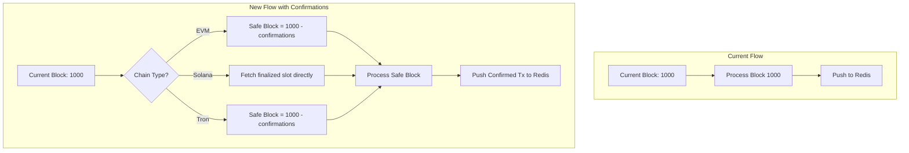

# Block Confirmations and Finality Implementation

## Overview

This plan implements block confirmation buffers across all chain listeners to protect against chain reorganizations and flash token attacks. The core idea is to introduce a configurable delay between the current chain block and the block being processed.

## Architecture




## Configuration Structure

Add a new `confirmations` module to [`packages/chain-config/src/`](packages/chain-config/src/index.ts):

```typescript
// packages/chain-config/src/confirmations/index.ts
export interface ChainConfirmationConfig {
  chainId: ListenerChainId;
  confirmations: number;        // Block confirmations required (0 for Solana)
  useFinalizedCommitment: boolean; // true for Solana
}

export const CHAIN_CONFIRMATIONS: Record<ListenerChainId, ChainConfirmationConfig> = {
  eth: { chainId: 'eth', confirmations: 7, useFinalizedCommitment: false },
  bnb: { chainId: 'bnb', confirmations: 12, useFinalizedCommitment: false },
  poly: { chainId: 'poly', confirmations: 40, useFinalizedCommitment: false },
  sol: { chainId: 'sol', confirmations: 0, useFinalizedCommitment: true },
  trc: { chainId: 'trc', confirmations: 20, useFinalizedCommitment: false },
};
```


## Key Changes

### 1. Chain Config Package Updates

**File:** [`packages/chain-config/src/confirmations/index.ts`](packages/chain-config/src/confirmations/index.ts) (new)

- Define `ChainConfirmationConfig` interface
- Export `CHAIN_CONFIRMATIONS` with default values
- Add `getConfirmations(chainId)` utility function
- Update `FullChainConfig` type to include confirmation config

### 2. Base Listener Changes

**File:** [`services/listener-engine/src/listener/listeners/base.listener.ts`](services/listener-engine/src/listener/listeners/base.listener.ts)

- Add `confirmations` property from chain config
- Modify `start()` to handle `lastProcessedBlock === 0` case:
- If 0: Start from `(currentBlock - confirmations)` for EVM/Tron, or current finalized slot for Solana
- If > 0: Continue from saved checkpoint
- Add `getSafeBlockHeight()` method: returns `currentBlock - confirmations`
- Update `replayBlocks()` to respect confirmation buffer (process up to `currentBlock - confirmations`)
- Update real-time logic to maintain confirmation gap

### 3. EVM Listener Changes

**File:** [`services/listener-engine/src/listener/listeners/evm.listener.ts`](services/listener-engine/src/listener/listeners/evm.listener.ts)

- Override `getSafeBlockHeight()` to return `currentBlock - confirmations`
- Update `startRealTimeListening()` to only process blocks up to safe height
- Modify the polling loop condition: `while (this.lastProcessedBlock < safeBlock)`

### 4. Solana Listener Changes

**File:** [`services/listener-engine/src/listener/listeners/solana.listener.ts`](services/listener-engine/src/listener/listeners/solana.listener.ts)

- Change connection commitment from `'confirmed'` to `'finalized'`
- The `getSlot()` call will automatically return the finalized slot
- No block buffer needed since finalized commitment handles this natively
- Update `rotateRpc()` to maintain `'finalized'` commitment

### 5. Tron Listener Changes

**File:** [`services/listener-engine/src/listener/listeners/tron.listener.ts`](services/listener-engine/src/listener/listeners/tron.listener.ts)

- Implement same pattern as EVM: `getSafeBlockHeight()` returns `currentBlock - confirmations`
- Update real-time polling to respect confirmation buffer

## Implementation Details

### Handling `lastProcessedBlock === 0`

When the listener starts fresh (no checkpoint):

```typescript
// In base.listener.ts start() method
if (this.lastProcessedBlock === 0) {
  // Fresh start: begin from safe block (no historical replay)
  const safeBlock = await this.getSafeBlockHeight();
  this.lastProcessedBlock = safeBlock;
  await this.saveCheckpoint(safeBlock);
  this.logger.log(`Fresh start: Beginning from safe block ${safeBlock}`);
}
```


### Real-time Processing Loop

```typescript
// Updated polling logic in EVM/Tron listeners
const currentBlock = await this.getCurrentBlockHeight();
const safeBlock = currentBlock - this.confirmations;

while (this.lastProcessedBlock < safeBlock && this.isRunning) {
  const nextBlock = this.lastProcessedBlock + 1;
  await this.processBlock(nextBlock);
  await this.saveCheckpoint(nextBlock);
}
```


### Solana Special Case

```typescript
// In solana.listener.ts constructor
this.connection = new Connection(this.rpcUrls[this.rpcIndex], 'finalized');

// getCurrentBlockHeight() already returns finalized slot
// No additional buffer needed
```


## Files to Modify

| File | Changes ||------|---------|| [`packages/chain-config/src/confirmations/index.ts`](packages/chain-config/src/confirmations/index.ts) | New file: confirmation configs || [`packages/chain-config/src/types/index.ts`](packages/chain-config/src/types/index.ts) | Add `ChainConfirmationConfig` type || [`packages/chain-config/src/chains/index.ts`](packages/chain-config/src/chains/index.ts) | Include confirmations in `FullChainConfig` || [`packages/chain-config/src/index.ts`](packages/chain-config/src/index.ts) | Export confirmation utilities || [`services/listener-engine/src/listener/listeners/base.listener.ts`](services/listener-engine/src/listener/listeners/base.listener.ts) | Add confirmation handling, fresh start logic || [`services/listener-engine/src/listener/listeners/evm.listener.ts`](services/listener-engine/src/listener/listeners/evm.listener.ts) | Update real-time loop for confirmations || [`services/listener-engine/src/listener/listeners/solana.listener.ts`](services/listener-engine/src/listener/listeners/solana.listener.ts) | Use 'finalized' commitment || [`services/listener-engine/src/listener/listeners/tron.listener.ts`](services/listener-engine/src/listener/listeners/tron.listener.ts) | Update real-time loop for confirmations |

## Status Reporting Enhancement

Update `ListenerStatus` interface to include confirmation info:

```typescript
interface ListenerStatus {
  // ... existing fields
  confirmations: number;
  safeBlock: number;  // currentBlock - confirmations
  confirmationLag: number; // blocks behind tip
}


```