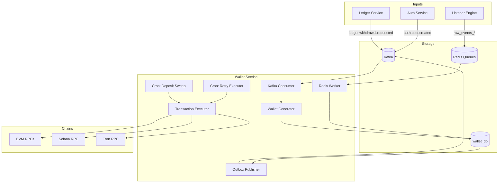

# Wallet Service Implementation Plan

## Overview

Build a backend execution engine responsible for:

- Creating custodial wallets when users sign up (via Kafka `auth.user.created`)
- Processing blockchain deposits from Redis queues (from listener-engine)
- Executing on-chain withdrawals triggered by Ledger events
- Running cron jobs for withdrawal retries and deposit sweeps
- Emitting Kafka events (never mutating Ledger state directly)

## Architecture




## Implementation Phases

### Phase 1: Service Scaffolding and Database

**1.1 Create service structure** at `services/wallet/`

- Follow existing service patterns from [services/auth/](services/auth/) and [services/listener-engine/](services/listener-engine/)
- Standard NestJS setup with health module, prisma module, config module

**1.2 Define Prisma schema** at `services/wallet/prisma/schema.prisma`

- Tables: `user_wallets`, `deposit_transactions`, `payout_requests`, `payout_attempts`, `kafka_outbox`, `processed_events`
- Use `wallet_db` schema following the existing pattern

**1.3 Add wallet-related Kafka topics and schemas** to [packages/kafka-core/](packages/kafka-core/)

- Add `WalletTopics` enum with: `DEPOSIT_DETECTED`, `WITHDRAWAL_COMPLETED`, `WITHDRAWAL_FAILED`
- Add `LedgerTopics.WITHDRAWAL_REQUESTED` for incoming withdrawal requests
- Add corresponding payload interfaces

### Phase 2: Wallet Generation (Kafka Consumer)

**2.1 Create wallet generation module** at `services/wallet/src/wallet-generator/`

- Consume `auth.user.created` from Kafka
- Generate 3 wallets per user: EVM, Solana, Tron
- Encrypt private keys with AES-256 (master key from `WALLET_ENCRYPTION_KEY` env var)
- Idempotency via `processed_events` table

**2.2 Chain-specific wallet generation**

- EVM: Use ethers.js `Wallet.createRandom()`
- Solana: Use `@solana/web3.js` `Keypair.generate()`
- Tron: Use `tronweb` for address generation

### Phase 3: Deposit Processing (Redis Consumer)

**3.1 Create Redis worker module** at `services/wallet/src/deposit-worker/`

- BLPOP from `raw_events_*` queues (same queues as listener-engine pushes to)
- Match deposits to user wallets via `deposit_address`
- Insert into `deposit_transactions` with idempotency on `(chain, tx_hash)`

**3.2 Confirmation checking**

- Load `min_confirmations` from chain config
- When confirmations met, emit `wallet.deposit.detected` via outbox pattern
- Acknowledge Redis message only after DB write

### Phase 4: Withdrawal Execution (Kafka Consumer)

**4.1 Create payout module** at `services/wallet/src/payout/`

- Consume `ledger.withdrawal.requested` from Kafka
- Validate chain support and health status
- Execute on-chain transaction from hot wallet

**4.2 Transaction execution per chain**

- EVM: ethers.js with gas estimation
- Solana: @solana/web3.js with priority fees
- Tron: tronweb with energy/bandwidth handling

**4.3 Hot wallet funding logic**

- Check balance threshold from config
- Auto-fund from funding wallet if below threshold

### Phase 5: Cron Jobs

**5.1 Withdrawal retry cron** at `services/wallet/src/cron/`

- Use `@nestjs/schedule` with `@Cron()` decorator
- Query pending `payout_requests`, retry execution
- Log attempts to `payout_attempts` table

**5.2 Deposit sweep cron**

- Find user wallets with token balance > 0
- Transfer gas from funding wallet
- Sweep tokens to platform hot wallet

### Phase 6: Outbox Pattern and API

**6.1 Kafka outbox publisher**

- Background worker polls `kafka_outbox` table
- Publishes to Kafka, updates status
- Handles retries with exponential backoff

**6.2 Read-only API**

- `GET /api/v1/payouts?user_id={uuid}` - List payout requests
- Health endpoint at `/api/v1/health`

### Phase 7: Configuration and Docker

**7.1 Chain configuration** at `services/wallet/src/config/`

- `min_confirmations` per chain
- `gas_price_strategy` settings
- `funding_thresholds` and `refund_thresholds`
- Hot wallet addresses and RPC endpoints

**7.2 Docker and docker-compose**

- Add Dockerfile following [services/auth/Dockerfile](services/auth/Dockerfile) pattern
- Add wallet-service to docker-compose.yml on port 3004

## Key Files to Create

| File | Purpose ||------|---------|| `services/wallet/prisma/schema.prisma` | Database schema with 5 tables || `services/wallet/src/main.ts` | Service entry point || `services/wallet/src/app.module.ts` | Root module with Kafka, Redis, Prisma || `services/wallet/src/wallet-generator/` | User wallet creation from Kafka || `services/wallet/src/deposit-worker/` | Redis consumer for deposits || `services/wallet/src/payout/` | Withdrawal execution logic || `services/wallet/src/cron/` | Scheduled jobs for retries/sweeps || `services/wallet/src/chain-executor/` | Chain-specific transaction execution || `services/wallet/src/outbox/` | Kafka outbox publisher || `services/wallet/src/config/chain.config.ts` | Chain-specific configuration || `packages/kafka-core/src/constants/topics.enum.ts` | Add WalletTopics || `packages/kafka-core/src/schemas/event.schema.ts` | Add wallet event payloads |

## Dependencies to Add

```json
{
  "dependencies": {
    "@solana/web3.js": "^1.87.0",
    "tronweb": "^5.3.0",
    "@nestjs/schedule": "^4.0.0"
  }
}


```