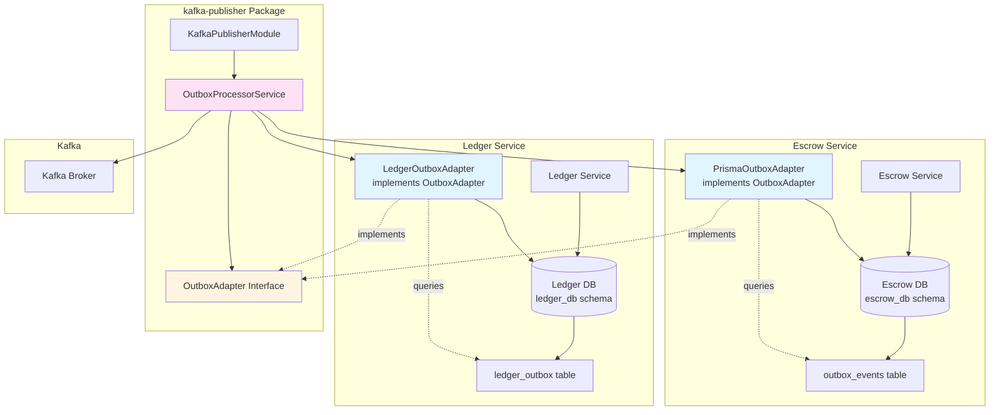
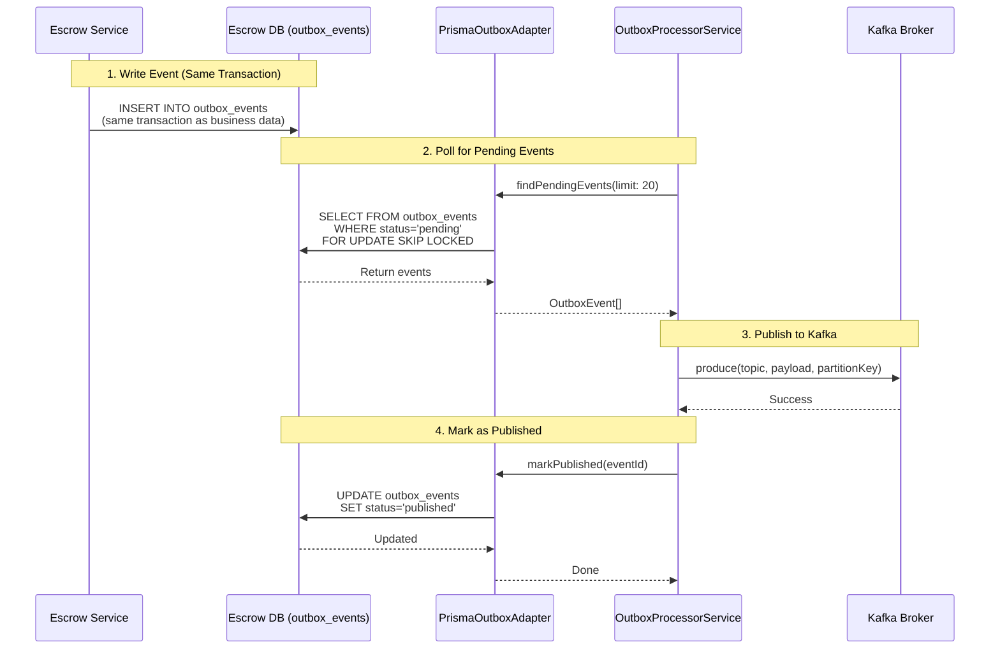

# Kafka Publisher Architecture - How It Uses Service Databases

## Overview

The `kafka-publisher` package uses the **Adapter Pattern** to work with each service's own database. Each service implements an `OutboxAdapter` that queries its own outbox table.

## Architecture Diagram



## Data Flow



## Code Implementation

### 1. Interface Definition (kafka-publisher package)

```typescript
// packages/kafka-publisher/src/interfaces/outbox-adapter.interface.ts
export interface OutboxAdapter {
  findPendingEvents(limit: number): Promise<OutboxEvent[]>;
  markPublished(id: string): Promise<void>;
  markFailed(id: string, error: string, retryCount: number, nextRetryAt: Date): Promise<void>;
  markPermanentlyFailed(id: string, error: string, retryCount: number): Promise<void>;
}
```

### 2. Service-Specific Adapter (Escrow Service)

```typescript
// services/escrow/src/kafka/prisma-outbox.adapter.ts
@Injectable()
export class PrismaOutboxAdapter implements OutboxAdapter {
  constructor(private readonly prisma: PrismaService) {}
  
  async findPendingEvents(limit: number): Promise<OutboxEvent[]> {
    // ⚠️ Queries ESCROW service's own database
    const events = await this.prisma.$queryRaw`
      SELECT * FROM outbox_events  -- ← Escrow DB table
      WHERE status = 'pending'
      FOR UPDATE SKIP LOCKED
      LIMIT ${limit}
    `;
    return events.map(/* map to OutboxEvent */);
  }
  
  async markPublished(id: string): Promise<void> {
    // ⚠️ Updates ESCROW service's own database
    await this.prisma.outboxEvent.update({
      where: { id },
      data: { status: 'published' }
    });
  }
}
```

### 3. Module Registration (Escrow Service)

```typescript
// services/escrow/src/app.module.ts
@Module({
  imports: [
    DatabaseModule,  // Provides PrismaService for escrow_db
    
    KafkaPublisherModule.forRoot({
      adapter: PrismaOutboxAdapter,  // ← Service-specific adapter
      config: {
        pollingIntervalMs: 2000,
        batchSize: 20,
      },
    }),
  ],
})
export class AppModule {}
```

### 4. OutboxProcessorService (kafka-publisher package)

```typescript
// packages/kafka-publisher/src/services/outbox-processor.service.ts
@Injectable()
export class OutboxProcessorService {
  constructor(
    private readonly adapter: OutboxAdapter,  // ← Injected adapter (service-specific)
    private readonly kafka: KafkaService,
    private readonly config: PublisherConfig,
  ) {}
  
  private async processBatch(): Promise<void> {
    // Uses adapter to query service's database
    const events = await this.adapter.findPendingEvents(this.batchSize);
    
    for (const event of events) {
      // Publish to Kafka
      await this.kafka.produce(event.topic, payload, event.partitionKey);
      
      // Mark as published using adapter
      await this.adapter.markPublished(event.id);
    }
  }
}
```

### 5. Module Factory (kafka-publisher package)

```typescript
// packages/kafka-publisher/src/module/kafka-publisher.module.ts
static forRoot(options: {
  adapter: new (...args: any[]) => OutboxAdapter;  // ← Service provides adapter class
  config?: PublisherConfig;
}): DynamicModule {
  return {
    providers: [
      {
        provide: 'OUTBOX_ADAPTER',
        useClass: options.adapter,  // ← Creates service-specific adapter instance
      },
      {
        provide: OutboxProcessorService,
        inject: ['OUTBOX_ADAPTER', KafkaService, 'PUBLISHER_CONFIG'],
        useFactory: (adapter: OutboxAdapter, kafka, config) => {
          return new OutboxProcessorService(adapter, kafka, config);
          // ↑ Adapter is injected here - it queries service's own DB
        },
      },
    ],
  };
}
```

## Database Schema Examples

### Escrow Service Database

```sql
-- services/escrow/prisma/schema.prisma
-- Schema: escrow_db

CREATE TABLE outbox_events (
    id TEXT PRIMARY KEY,
    topic TEXT NOT NULL,
    "partitionKey" TEXT NOT NULL,
    payload TEXT NOT NULL,
    status TEXT DEFAULT 'pending',
    "retryCount" INTEGER DEFAULT 0,
    "lastError" TEXT,
    "createdAt" TIMESTAMP DEFAULT NOW(),
    "publishedAt" TIMESTAMP,
    "nextRetryAt" TIMESTAMP
);

-- Indexes for performance
CREATE INDEX outbox_events_status_idx ON outbox_events(status);
CREATE INDEX outbox_events_createdAt_idx ON outbox_events("createdAt");
```

### Ledger Service Database

```sql
-- services/ledger/prisma/schema.prisma
-- Schema: ledger_db

CREATE TABLE ledger_outbox (
    id TEXT PRIMARY KEY,
    eventType TEXT NOT NULL,
    eventKey TEXT UNIQUE NOT NULL,
    payload JSONB NOT NULL,
    status TEXT DEFAULT 'pending',
    attempts INTEGER DEFAULT 0,
    createdAt TIMESTAMP DEFAULT NOW(),
    updatedAt TIMESTAMP
);

-- Different schema, but adapter maps to OutboxEvent interface
```

## Key Points

### ✅ Each Service Has Its Own Database

- **Escrow Service**: `escrow_db.outbox_events`
- **Ledger Service**: `ledger_db.ledger_outbox`
- **Admin Service**: `admin_db.outbox_events` (if implemented)

### ✅ Adapter Pattern Provides Abstraction

```typescript
// Generic processor doesn't know about specific tables
OutboxProcessorService → OutboxAdapter (interface)
                                    ↓
                    ┌───────────────┴───────────────┐
                    ↓                               ↓
        PrismaOutboxAdapter              LedgerOutboxAdapter
        (queries escrow_db)             (queries ledger_db)
```

### ✅ Dependency Injection Flow

```
1. Service registers adapter class in KafkaPublisherModule.forRoot()
2. NestJS creates adapter instance (with service's PrismaService)
3. OutboxProcessorService receives adapter instance
4. Processor calls adapter methods → adapter queries service's DB
```

### ✅ Transactional Guarantees

```typescript
// In Escrow Service business logic
await prisma.$transaction(async (tx) => {
  // 1. Update business data
  await tx.escrow.update({ ... });
  
  // 2. Write to outbox (same transaction!)
  await tx.outboxEvent.create({
    topic: 'escrow.created',
    payload: JSON.stringify(event),
  });
  
  // Both succeed or both fail - atomic!
});
```

## Comparison: Single Table vs Service-Specific Tables

### ❌ Single Shared Table (NOT used)

```typescript
// This would require shared database access
const events = await sharedDb.query(`
  SELECT * FROM shared_outbox_events
  WHERE service_name = 'escrow'  -- Filter by service
`);
```

**Problems:**
- Requires shared database connection
- Cross-service dependencies
- Harder to scale
- No transactional guarantees with service data

### ✅ Service-Specific Tables (Current Implementation)

```typescript
// Each service queries its own database
// Escrow adapter
const events = await escrowPrisma.$queryRaw`
  SELECT * FROM outbox_events  -- Escrow's own table
`;

// Ledger adapter  
const events = await ledgerPrisma.$queryRaw`
  SELECT * FROM ledger_outbox  -- Ledger's own table
`;
```

**Benefits:**
- ✅ Service isolation
- ✅ Database isolation
- ✅ Transactional guarantees
- ✅ Independent scaling
- ✅ No cross-service dependencies

## Example: Adding a New Service

```typescript
// 1. Create adapter in your service
// services/payment/src/kafka/payment-outbox.adapter.ts
@Injectable()
export class PaymentOutboxAdapter implements OutboxAdapter {
  constructor(private readonly prisma: PrismaService) {}
  
  async findPendingEvents(limit: number): Promise<OutboxEvent[]> {
    // Query payment service's own database
    return await this.prisma.$queryRaw`
      SELECT * FROM payment_outbox  -- Payment's own table
      WHERE status = 'pending'
      LIMIT ${limit}
    `;
  }
  
  // ... implement other methods
}

// 2. Register in service module
// services/payment/src/app.module.ts
@Module({
  imports: [
    KafkaPublisherModule.forRoot({
      adapter: PaymentOutboxAdapter,  // ← Your service-specific adapter
      config: { pollingIntervalMs: 2000 },
    }),
  ],
})
export class AppModule {}
```

## Summary

The `kafka-publisher` package is **database-agnostic** and uses the **Adapter Pattern**:

1. **Generic Package**: `kafka-publisher` defines the `OutboxAdapter` interface
2. **Service Implementation**: Each service implements adapter for its own database
3. **Dependency Injection**: Service provides adapter instance to the package
4. **Database Access**: Adapter queries service's own outbox table
5. **Isolation**: Each service maintains its own database and schema

This design provides **service isolation**, **transactional guarantees**, and **independent scalability** while maintaining a consistent event publishing interface across all services.

