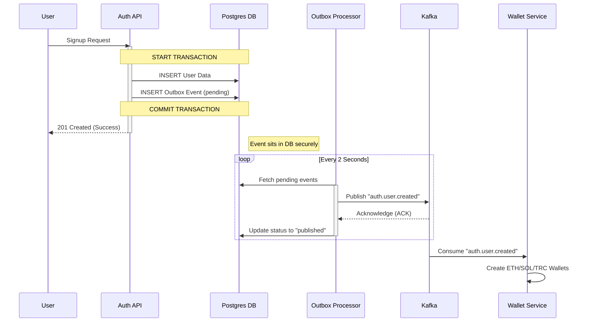

# Kafka Integration & Outbox Pattern Guide

This document explains how the reliable Kafka integration works in the Auth Service using the **Transactional Outbox Pattern**.

## 🚀 Why this architecture?

We use the **Outbox Pattern** to ensure **100% data consistency** between our database and Kafka. 

**The Problem without Outbox:**
If we save a user to the DB and then try to publish to Kafka, the publishing might fail (network error, Kafka down). Then we have a "phantom user" in our DB but no wallets created because the event never went out. Reversing the order has the same risk.

**The Solution (Outbox):**
We write the event to a database table (`outbox_events`) in the **SAME transaction** as creating the user. This guarantees that **if the user is created, the event is created**. They succeed or fail together.

---

## 🔄 The Complete Flow

### 1. The Trigger (User Action)
A user signs up via the API.

### 2. The Transaction (Auth Service)
Inside `AuthService.signup()`, a single database transaction does two things:
1.  **Writes User Data**: Inserts into `users`, `user_profiles`, `auth_credentials` tables.
2.  **Writes Event**: Inserts a row into `outbox_events` table (status: `pending`).



---

## 🛠 Component Breakdown

### 1. The Producer (`AuthEventProducer`)
Instead of talking to Kafka directly, this service just writes to the database.

```typescript
// src/kafka/auth-event.producer.ts
async userCreated(userId: string, ...) {
  // Just writes to DB table 'outbox_events'
  await this.prisma.outboxEvent.create({
    data: {
      eventType: 'user.created',
      topic: 'auth.events',
      payload: JSON.stringify({...}),
      status: 'pending' // <--- Waiting to be picked up
    }
  });
}
```

### 2. The Outbox Processor (Background Worker)
This is part of the `@escrowly/kafka-publisher` package. It runs in the background of your application.
- **Polls**: Checks DB every 2s for `pending` events.
- **Locks**: Uses `FOR UPDATE SKIP LOCKED` so if you run 10 instances of Auth Service, they won't process the same event twice.
- **Publishes**: Sends the payload to the actual Kafka broker.
- **Retries**: If Kafka is down, it updates `retry_count` and tries again later (Exponential Backoff).

### 3. The Consumer (`AuthEventConsumer`)
The Auth Service also acts as a consumer for other services.
- Listsens to `wallet.events` and `compliance.events`.
- When the Wallet Service finishes creating wallets, it sends an event back.
- We consume it and update `user_profiles.wallet_ready = true`.

---

## 📊 Monitoring & Debugging

### Database Status
You can check the status of events directly in your database:

```sql
-- Check pending events (queue size)
SELECT count(*) FROM auth_db.outbox_events WHERE status = 'pending';

-- Check for failures
SELECT * FROM auth_db.outbox_events WHERE status = 'failed';

-- See what was published
SELECT event_type, published_at FROM auth_db.outbox_events WHERE status = 'published' ORDER BY published_at DESC;
```

### Event Status Lifecycle
1. `pending`: Created in DB, waiting for processor.
2. `locked`: Currently being processed by an instance.
3. `published`: Successfully sent to Kafka.
4. `failed`: Failed to send (kafka down, network issue). Will retry until max retries.

---

## ⚙️ Configuration

Control the behavior in `src/kafka/kafka-events.module.ts`:

```typescript
KafkaPublisherModule.forRoot({
  adapter: PrismaOutboxAdapter,
  config: {
    pollingIntervalMs: 2000, // Check DB every 2 seconds
    batchSize: 20,           // Process 20 events at a time
    maxRetries: 5,           // Try 5 times before failing
    baseBackoffMs: 5000,     // Wait 5s before first retry
  },
}),
```

To enable the actual sending to Kafka, set in `.env`:
```bash
KAFKA_ENABLED=true
```
